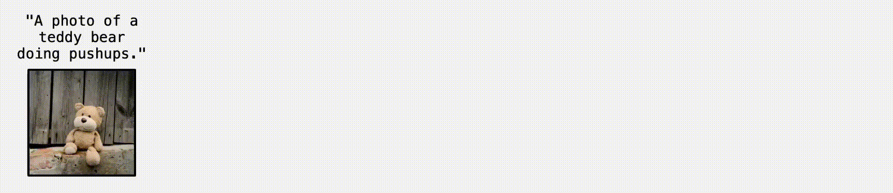

# Pathways on the Image Manifold: Image Editing via Video Generation

Welcome to the official repository for our [paper📝](https://arxiv.org/abs/2411.16819)!

We are happy to announce that our paper has been **accepted to CVPR 2025**! 🎉  

Check out our [project page 💻](https://rotsteinnoam.github.io/Frame2Frame/) for more details.

 

## Resources
The repository contains:
- [Our results on the TEdBench dataset.](data/TEdBench_results/)
- [The newly introduced PosEdit dataset.](data/PosEdit/)
- [Our results on PosEdit.](data/PosEdit_results/)